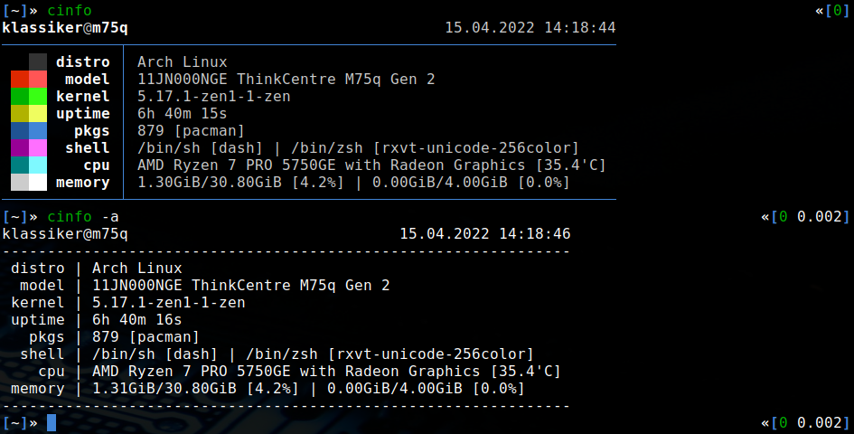

# cinfo

a minimal system information tool for linux-based operating systems



## installation

edit config.mk to match your local setup (cinfo is installed into
the /usr/local namespace by default)

afterwards enter the following command to build and install cinfo (if
necessary as root):

```bash
make clean install
```

## run

```bash
cinfo
```
