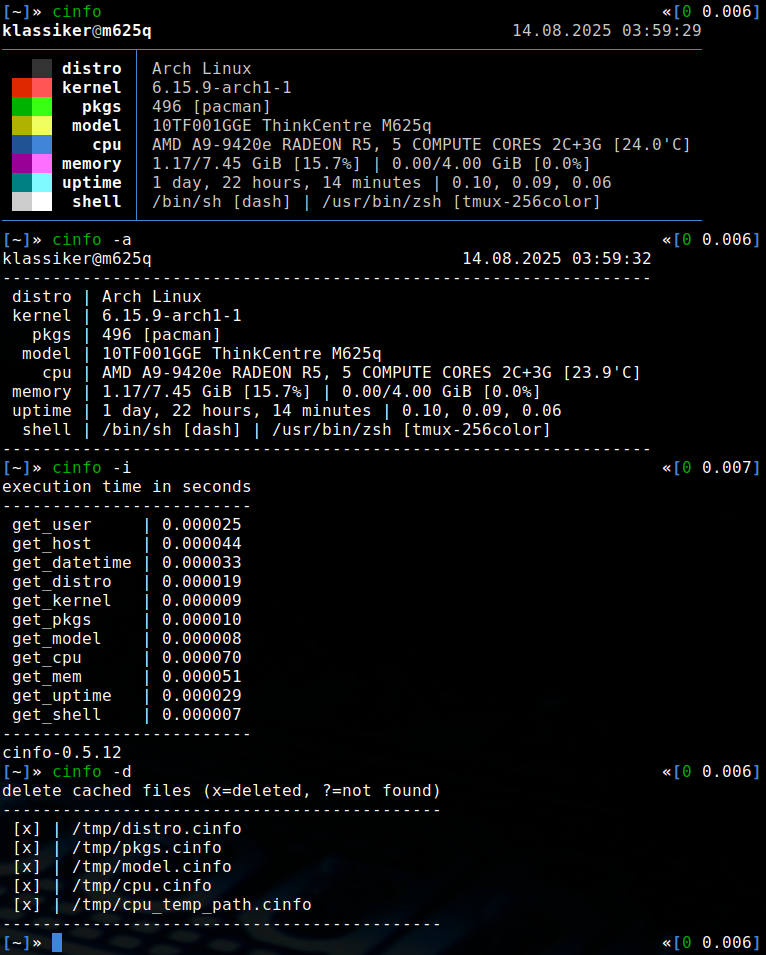

# cinfo

a fast and minimal system information tool for linux-based operating systems



## Installation

[](https://repology.org/project/cinfo/versions)

Edit config.mk to match your local setup (cinfo is installed into
the /usr/local namespace by default)

Afterwards enter the following command to build and install cinfo (if
necessary as root):

```bash
make clean install
```

## Run

```bash
cinfo
```

## Manual

You can view the manual by running `man cinfo` or `man cinfo.1`,
if you've already ran `make clean install`.
